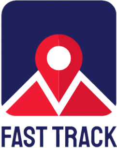

# Fast Track
 </img>

## Inspiration
The current state of the world has left gas prices at an all time high and it is more important than ever to be fuel efficient. Whether it be for delivery services, or personal use saving fuel is just as important. In an effort to help increase fuel efficiency, lower costs, and help the environment we created Fast Track.

## What it does
Taking user inputed destinations, Fast Track calculates the most efficient and optimized route you can take, as well as providing directions for the user to get there. In doing so we are able to minimize costs, shorten delivery times, and maximize fuel efficiency.

## How we built it
Our application, Fast Track takes locations from users and calculates the shortest path through all locations. We do this by running an algorithm to rearrange different paths to find the shortest distance. We used the Position Stack API to get location data and used the Leaflet API to display map data.

## Challenges we ran into
* Working with the Leaflet API was a struggle due to the lack of customization and the lack of detail in the developer documentation.
* Position Stack API led to a Mixed Content URL error which was difficult to resolve.
* The Algorithm Implementation was difficult due to the complexity and variety of algorithms online.

## Accomplishments that we're proud of
We are proud that we were able to create a working application in such a short time. We were able to put all our interests together to create an impactful project to help with a problem in the current state of the world.

## What we learned
1) Learned how to display and control map graphics using the Leaflet API
2) Learned how to convert an address to a Longitude and Latitude point using Position Stack API
3) Learned how to customize the Vite bundler

## What's next for Fast Track
The next steps for Fast Track would be to get a license for this application and outsource it to more users to get more traffic..

## Link
[Live Hosting of Fast Track](https://fast-track-ten.vercel.app/)

## Run Locally

**Requires TomTom API Key with Search Functionality Enabled**

Clone the project

```bash
  git clone https://github.com/krash3125/fast-track.git
```

Go to the project directory

```bash
  cd fast-track
```

Install dependencies

```bash
  npm install
```

Start the  server

```bash
  npm run dev
```
